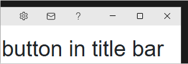

[Click here for English version](#call-blazor-functionality-from-buttons-in-the-title-bar)

Danish version:

# Kald Blazor funktionalitet fra knapper i titelbjælken

Tilføj knapper, i titelbjælken, der kalder Blazor funktionalitet i en .NET MAUI Blazor Hybrid Windows applikation.

I en moderne applikation, er det et ønske at kunne tilføje knapper i titelbjælken, som kan kalde funktionalitet i
Blazor delen af applikationen. Dette repository viser, hvordan du kan gøre netop dette til fx at kalde en kontekstsensitiv
hjælp, åbne en indstillingsside og lignende.

I repository'et finder du den nødvendige kode og vejledning til, hvordan du kan implementere dette i dine egne projekter.

# Sådan er det implementeret

I en .NET MAUI Blazor Hybrid Windows applikation, er der to lag: .NET MAUI laget (WinUI3) og Blazor laget.

Umiddelbart kan disse to ikke kommunikere med hinanden. Det er nødvendigt at lave en "bro" mellem de to lag. Denne "bro" 
bygger på, at der skal sendes events fra WinUI3 laget til Blazor.

I applikationen, er der i `App.xaml.cs` filen, tilføjet knapper i en `TitleBar` klasse. Disse knapper ender med at kalde
events som den respektive Blazor funktionalitet er "lytter" på.

## Sådan gør du

1. Tilføj klassen `TitleBarService.cs` til din .NET MAUI Blazor Hybrid applikation

2. Tilføj klassen `TitleBarTools.cs` til din .NET MAUI Blazor Hybrid applikation
 
3. Implementer `TitleBarService` klassen

4. Implementer `TitleBarTools` klassen

5. Registrer `TitleBarService` i `MauiProgram.cs` filen

6. Inject `TitleBarService` i din Blazor komponent og brug den til at ændre titel og undertitel

7. Tilret `App.xaml.cs` filen der ligger i roden, så den opretter et TitleBar objekt og tilføjer de knapper du ønsker. Du
skal også tilføje et "navn" til den funktionalitet du ønsker at kalde.

Kik i koden for at se, hvordan det hele hænger sammen.

## Implementering i dine egne projekter

Du kan kopiere de relevante filer og kodebidder fra dette repository til dine egne .NET MAUI Blazor Hybrid projekter,
eller din værktøjskasse, så har du det klar og skal kun angive et minimum af kode.

# Anerkendelse

Venligst læs dokumentet "Acknowledgements.md".

# Call Blazor functionality from buttons in the title bar

Add buttons, to the title bar, that invoke Blazor functionality in a .NET MAUI Blazor Hybrid Windows application.

In a modern application, it is desirable to be able to add buttons to the title bar that can invoke functionality
in the Blazor part of the application. This repository shows how you can do exactly this—for example, to call
context-sensitive help, open a settings page, and similar features.

In the repository, you will find the necessary code and guidance on how to implement this in your own projects.

# How it is implemented

In a .NET MAUI Blazor Hybrid Windows application, there are two layers: the .NET MAUI layer (WinUI3)
and the Blazor layer.

Out of the box, these two layers cannot communicate with each other. It is necessary to create a 'bridge' between the
two layers. This 'bridge' is based on sending events from the WinUI3 layer to Blazor.

In the application, buttons are added in the `App.xaml.cs` file within a `TitleBar` class. These buttons end up
triggering events that the corresponding Blazor functionality is 'listening' for.

## How to do it

1. Add the `TitleBarService.cs` class to your .NET MAUI Blazor Hybrid application

2. Add the `TitleBarTools.cs` class to your .NET MAUI Blazor Hybrid application

3. Implement the `TitleBarService` class

4. Implement the `TitleBarTools` class

5. Register `TitleBarService` in the `MauiProgram.cs` file

6. Inject `TitleBarService` into your Blazor component and use it to change the title and subtitle

7. Modify the `App.xaml.cs` file located at the root so that it creates a `TitleBar` object and adds the buttons you want.
   You must also add a “name” for the functionality you want to invoke.

Check the code to see how everything fits together.

## Implementation in your own projects

You can copy the relevant files and code snippets from this repository into your own .NET MAUI Blazor Hybrid projects,
or into your toolbox, so you have it ready and only need to specify a minimal amount of code.

# Acknowledgement

Please read the document 'Acknowledgements.md'.
